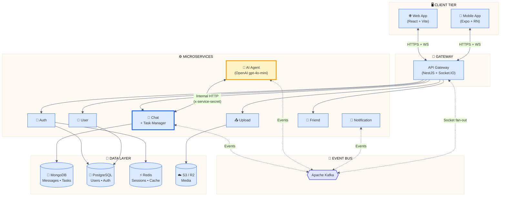
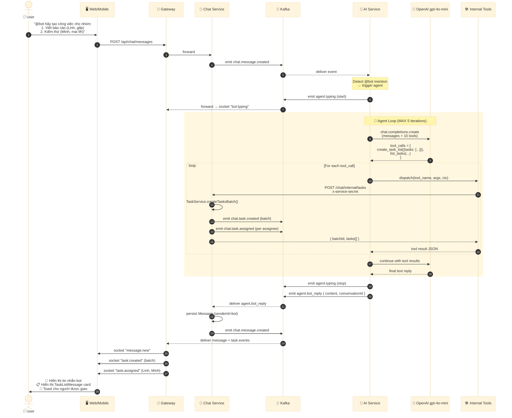
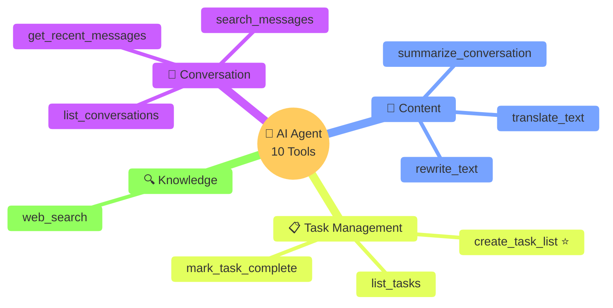
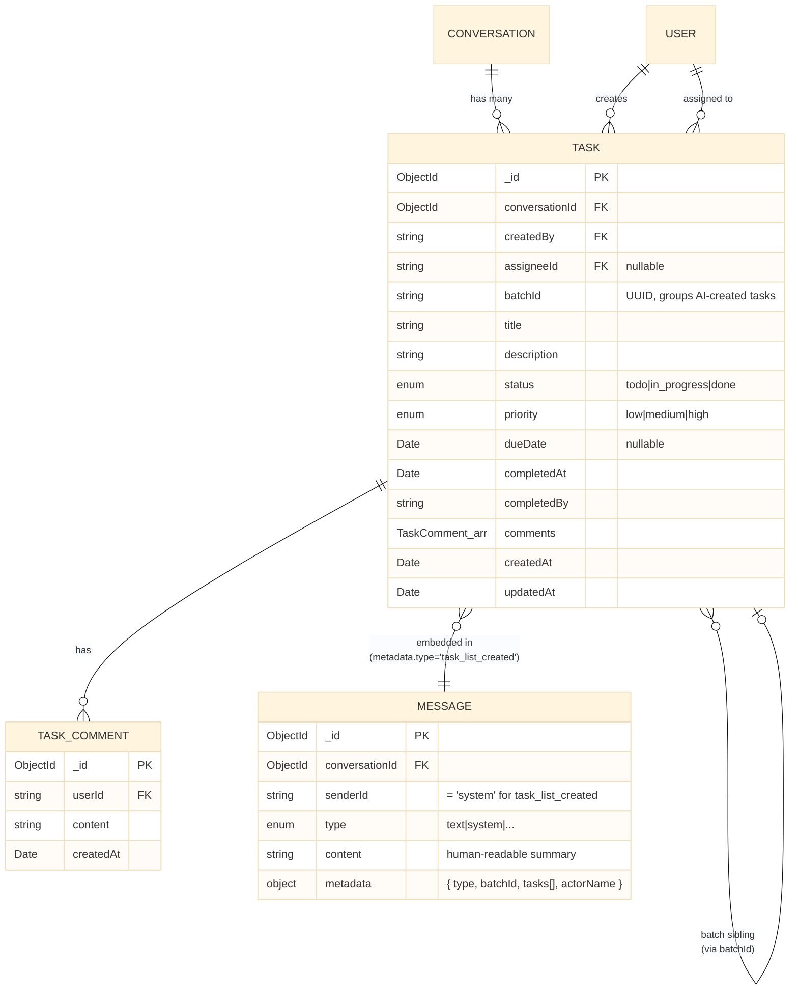
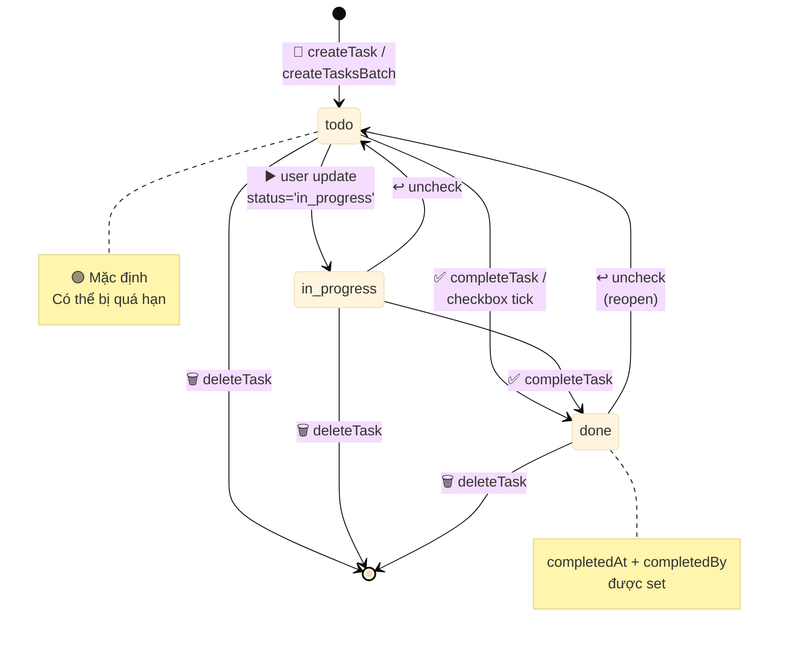
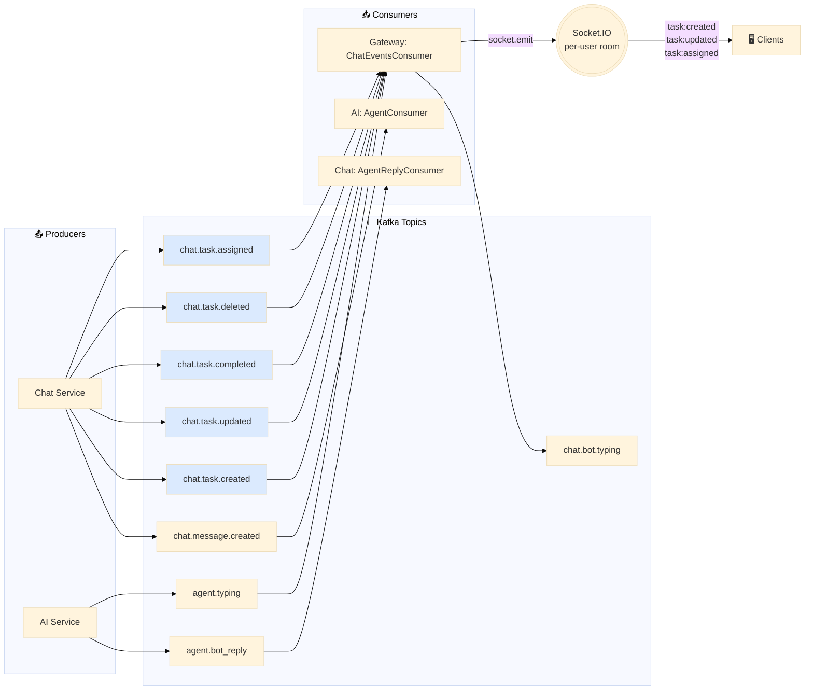

# 🤖 AI Agent & Task Management — Kiến trúc hệ thống

> Tài liệu này mô tả kiến trúc **AI Agent thông minh** kết hợp với **Hệ thống quản lý công việc nhóm** trong BinChat — một chat app microservices realtime.

---

## 1. 🎯 Sơ đồ tổng quan kiến trúc



---

## 2. 🧠 Luồng AI Agent (OpenAI Tool-Calling Loop)



---

## 3. 🧩 Sơ đồ thành phần (Component Diagram)

```mermaid
%%{init: {'theme':'base'}}%%
flowchart LR
    subgraph AI_SVC["🤖 services/ai"]
        AC[AgentConsumer<br/>@EventPattern]
        AS[AgentService<br/>.run loop]
        AT[AgentToolsService<br/>dispatch]
        ST[Tool Registry<br/>10 tools]
        AC --> AS --> AT --> ST
        AS <-->|"chat.completions"| OAI((OpenAI))
        AT -->|"axios + secret"| ICC
    end

    subgraph CHAT_SVC["💬 services/chat"]
        ICC[InternalChatController<br/>+ InternalGuard]
        TS[TaskService]
        NS[NoteService]
        MS[MessageService]
        ARC[AgentReplyConsumer]
        ICC --> TS
        ICC --> MS
        ARC --> MS
        TS --> MDB[(MongoDB<br/>Task schema)]
        MS --> MDB
    end

    subgraph GW_SVC["🚪 gateway"]
        CEC[ChatEventsConsumer<br/>Kafka → Socket]
        SG[SocketGateway<br/>emitToUser]
        CEC --> SG
    end

    subgraph FE["🖥️ Frontend"]
        CSI[ChatSocketInitializer<br/>web]
        UCS[useChatSocket<br/>mobile]
        TP[TaskPanel]
        TLM[TaskListMessage<br/>Card]
        CTM[CreateTaskModal]
        TP --> CTM
        CSI --> TP
        CSI --> TLM
        UCS --> TP
        UCS --> TLM
    end

    AS -->|emit agent.bot_reply<br/>agent.typing| KB[(Kafka)]
    TS -->|emit chat.task.*| KB
    KB --> ARC
    KB --> CEC
    SG -->|socket events| CSI
    SG -->|socket events| UCS

    style AI_SVC fill:#fef3c7,stroke:#f59e0b
    style CHAT_SVC fill:#dbeafe,stroke:#2563eb
    style GW_SVC fill:#dcfce7,stroke:#16a34a
    style FE fill:#fce7f3,stroke:#db2777
```

---

## 4. 🛠️ Bộ công cụ (Tools) của Agent



---

## 5. 📋 Mô hình dữ liệu Task



---

## 6. 🔄 Vòng đời (Lifecycle) của một Task



---

## 7. 🚀 Kafka Topics & Realtime Fan-out



---

## 8. 🎨 UI/UX Components

| Layer | Web | Mobile |
|---|---|---|
| **Header button** | `<CheckSquare>` icon in `ChatRoom.tsx` | `<CheckSquare>` in `conversation/[id].tsx` |
| **Task list view** | `TaskPanel` (right-drawer modal) | `TaskPanel` (bottom-sheet modal) |
| **Inline message** | `TaskListMessageCard` in `MessageBubble` | `TaskListMessage` in renderItem |
| **Create / edit** | `CreateTaskModal` | `CreateTaskModal` |
| **Realtime sync** | `ChatSocketInitializer` → `window.dispatchEvent` | `useChatSocket` → `DeviceEventEmitter` |

---

## 9. 💎 Điểm nổi bật kỹ thuật

✅ **Agent loop có giới hạn lặp** (MAX 5) — tránh infinite tool-calling
✅ **Internal service auth** — `x-service-secret` header chống truy cập trái phép
✅ **Batch operation 1-message** — AI tạo nhiều task chỉ phát 1 system message với metadata
✅ **Permission model 3 cấp** — assignee / creator / admin có quyền khác nhau
✅ **Realtime fan-out qua Kafka + Socket.IO room-per-user** — scale ngang dễ dàng
✅ **Inline interactive card** — checkbox trong message bubble đồng bộ realtime
✅ **Overdue detection client-side** — highlight đỏ khi `dueDate < now()`
✅ **Per-assignee toast notification** — chỉ người được giao mới nhận thông báo

---

## 10. 📊 Tóm tắt số liệu

| Hạng mục | Số lượng |
|---|---|
| AI tools | **10** |
| Kafka topics liên quan task & bot | **9** |
| API endpoint user-facing (task) | **6** |
| API endpoint internal (task/agent) | **4** |
| Socket events forwarded to client | **5 task + 2 bot** |
| UI components mới (web + mobile) | **6** |

