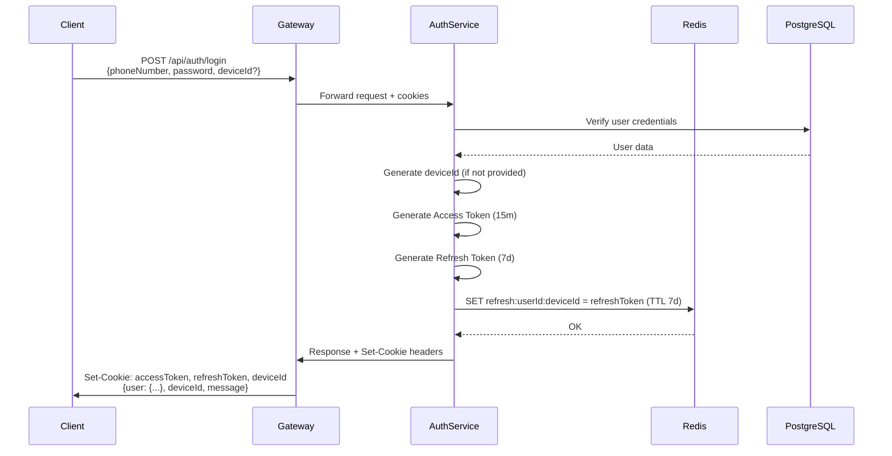
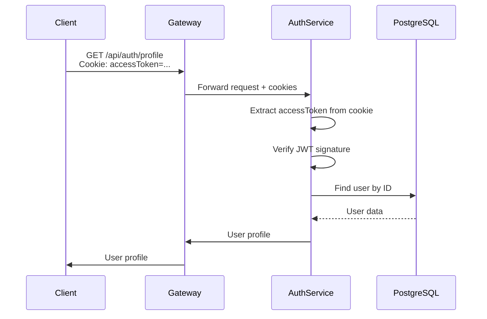
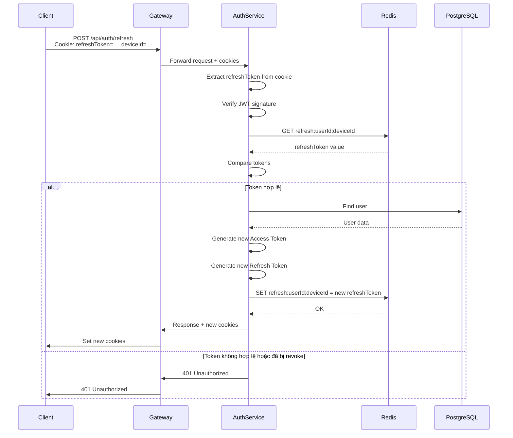
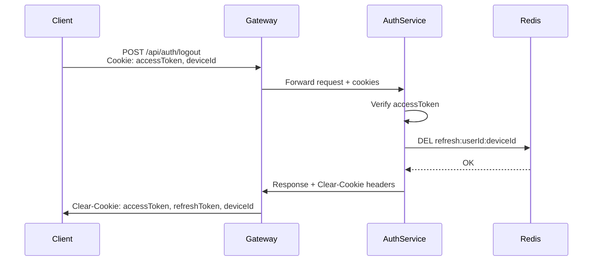
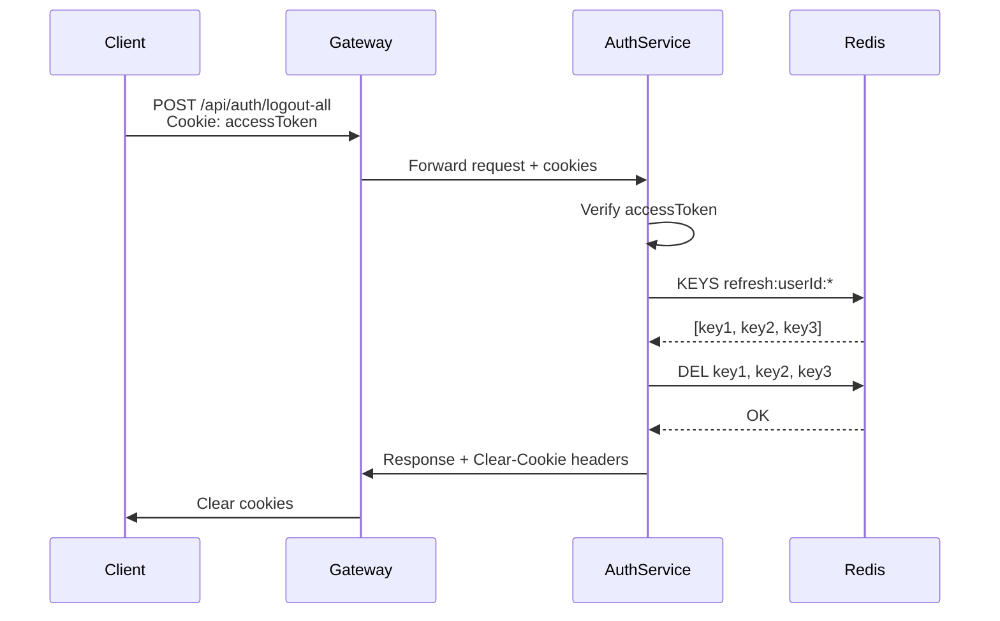

# 🔐 Cookie-Based JWT Authentication với Redis

## 📋 Tổng quan

Hệ thống đã được nâng cấp từ **Bearer Token** sang **Cookie-Based Authentication** với Redis để tăng cường bảo mật.

### ✅ Cải tiến chính:

1. **Access Token** → Lưu trong **HttpOnly Cookie** (không thể bị XSS đánh cắp)
2. **Refresh Token** → Lưu trong **Redis** (có thể revoke ngay lập tức)
3. **Device Management** → Hỗ trợ multi-device login/logout
4. **CORS với Credentials** → Frontend tự động gửi cookies

---

## 🔄 Luồng hoạt động mới

### **1️⃣ Register/Login**



**Request:**

```bash
POST /api/auth/login
Content-Type: application/json

{
  "phoneNumber": "0123456789",
  "password": "password123",
  "deviceId": "web-chrome-abc123"  # Optional
}
```

**Response:**

```json
{
  "user": {
    "id": "uuid",
    "phoneNumber": "0123456789",
    "fullName": "Nguyễn Văn A"
  },
  "deviceId": "web-chrome-abc123",
  "message": "Đăng nhập thành công"
}
```

**Cookies được set:**

```
Set-Cookie: accessToken=eyJhbGc...; HttpOnly; Secure; SameSite=Strict; Max-Age=900
Set-Cookie: refreshToken=eyJhbGc...; HttpOnly; Secure; SameSite=Strict; Max-Age=604800
Set-Cookie: deviceId=web-chrome-abc123; Secure; SameSite=Strict; Max-Age=604800
```

---

### **2️⃣ Access Protected Route**



**Request:**

```bash
GET /api/auth/profile
Cookie: accessToken=eyJhbGc...
```

**Response:**

```json
{
  "id": "uuid",
  "phoneNumber": "0123456789",
  "fullName": "Nguyễn Văn A",
  "isActive": true,
  "createdAt": "2026-02-06T..."
}
```

---

### **3️⃣ Refresh Token**



**Request:**

```bash
POST /api/auth/refresh
Cookie: refreshToken=eyJhbGc...; deviceId=web-chrome-abc123
```

**Response:** (giống login, set cookies mới)

---

### **4️⃣ Logout (Single Device)**



**Request:**

```bash
POST /api/auth/logout
Cookie: accessToken=...; deviceId=...
```

**Response:**

```json
{
  "message": "Đăng xuất thành công"
}
```

**Cookies bị xóa:**

```
Set-Cookie: accessToken=; Max-Age=0
Set-Cookie: refreshToken=; Max-Age=0
Set-Cookie: deviceId=; Max-Age=0
```

---

### **5️⃣ Logout All Devices**



**Request:**

```bash
POST /api/auth/logout-all
Cookie: accessToken=...
```

**Response:**

```json
{
  "message": "Đã đăng xuất tất cả thiết bị"
}
```

---

## 🛡️ Bảo mật

### **Cookie Options:**

```typescript
{
  httpOnly: true,        // JS không thể đọc → Chống XSS
  secure: true,          // Chỉ gửi qua HTTPS → Chống MITM
  sameSite: 'strict',    // Chống CSRF
  maxAge: 900000         // 15 phút (accessToken)
}
```

### **Redis Key Pattern:**

```
refresh:{userId}:{deviceId}
```

**Ví dụ:**

```
refresh:123e4567-e89b-12d3-a456-426614174000:web-chrome-abc123
refresh:123e4567-e89b-12d3-a456-426614174000:mobile-ios-xyz789
```

---

## 🔧 Cấu hình

### **Docker Compose:**

```yaml
redis:
  image: redis:7-alpine
  ports:
    - '6379:6379'

auth-service:
  environment:
    - REDIS_HOST=redis
    - REDIS_PORT=6379
```

### **Auth Service (.env):**

```env
REDIS_HOST=redis
REDIS_PORT=6379
JWT_SECRET=...
JWT_REFRESH_SECRET=...
JWT_ACCESS_EXPIRATION=15m
JWT_REFRESH_EXPIRATION=7d
```

### **API Gateway (.env):**

```env
CORS_ORIGIN=http://localhost:5173,http://localhost:3000
```

---

## 📝 Testing với Postman

### **1. Login:**

```javascript
// Request
POST http://localhost:3000/api/auth/login
Content-Type: application/json

{
  "phoneNumber": "0901234567",
  "password": "password123"
}

// Test Script
pm.test("Should set cookies", function () {
    pm.expect(pm.cookies.has('accessToken')).to.be.true;
    pm.expect(pm.cookies.has('refreshToken')).to.be.true;
    pm.expect(pm.cookies.has('deviceId')).to.be.true;
});
```

### **2. Get Profile (cookies tự động gửi):**

```javascript
// Request
GET http://localhost:3000/api/auth/profile
// Không cần header Authorization, cookies tự động gửi!
```

### **3. Refresh Token:**

```javascript
// Request
POST http://localhost:3000/api/auth/refresh
// Cookies tự động gửi
```

### **4. Logout:**

```javascript
// Request
POST http://localhost:3000/api/auth/logout

// Test Script
pm.test("Should clear cookies", function () {
    pm.expect(pm.cookies.has('accessToken')).to.be.false;
});
```

---

## 🔄 Migrate từ Bearer Token

### **Frontend Changes:**

#### **Trước (Bearer Token):**

```typescript
// ❌ Cũ
const response = await axios.post('/api/auth/login', {
  phoneNumber,
  password,
});

// Lưu token vào localStorage (không an toàn!)
localStorage.setItem('accessToken', response.data.accessToken);

// Thêm vào header mỗi request
axios.defaults.headers.common['Authorization'] = `Bearer ${accessToken}`;
```

#### **Sau (Cookie-Based):**

```typescript
// ✅ Mới
import axios from 'axios';

// Config axios để gửi cookies
axios.defaults.withCredentials = true;

// Login - không cần lưu token
const response = await axios.post('/api/auth/login', {
  phoneNumber,
  password,
});

// Cookies tự động được set bởi browser
// Các request sau tự động gửi cookies
await axios.get('/api/auth/profile'); // Không cần header!
```

---

## 🧪 Kiểm tra Redis

### **Kết nối Redis:**

```bash
docker exec -it chat-redis redis-cli
```

### **Xem tất cả refresh tokens:**

```bash
KEYS refresh:*
```

### **Xem token của user cụ thể:**

```bash
KEYS refresh:123e4567-e89b-12d3-a456-426614174000:*
```

### **Xem giá trị token:**

```bash
GET refresh:123e4567-e89b-12d3-a456-426614174000:web-chrome-abc123
```

### **Xóa token thủ công (force logout):**

```bash
DEL refresh:123e4567-e89b-12d3-a456-426614174000:web-chrome-abc123
```

---

## ⚠️ Lưu ý quan trọng

### **1. Production:**

- ✅ Bật `secure: true` (HTTPS only)
- ✅ Dùng `sameSite: 'strict'`
- ✅ Set Redis password
- ✅ Dùng strong JWT secrets

### **2. Mobile App:**

- Cookie-based auth **không phù hợp** cho mobile
- Mobile nên dùng Bearer Token (Authorization header)
- Có thể hỗ trợ cả 2 modes: cookie cho web, bearer cho mobile

### **3. Subdomain:**

Nếu frontend ở subdomain khác, config cookie domain:

```typescript
{
  domain: '.example.com',  // Share cookie giữa app.example.com và api.example.com
  sameSite: 'lax'          // Strict không work với subdomain
}
```

---

## 📊 So sánh Bearer vs Cookie

| Feature          | Bearer Token                   | Cookie-Based                      |
| ---------------- | ------------------------------ | --------------------------------- |
| **Bảo mật XSS**  | ❌ localStorage dễ bị đánh cắp | ✅ HttpOnly cookie không đọc được |
| **Bảo mật CSRF** | ✅ Không bị                    | ⚠️ Cần SameSite                   |
| **Revoke token** | ❌ Phải đợi expire             | ✅ Xóa Redis = logout ngay        |
| **Multi-device** | ❌ Khó quản lý                 | ✅ Redis tracking                 |
| **Mobile App**   | ✅ Dễ dùng                     | ❌ Phức tạp                       |
| **Web App**      | ⚠️ OK nhưng kém                | ✅ **Best Practice**              |

---

## 🚀 Deployment

### **Rebuild Docker images:**

```bash
# Stop services
docker-compose down

# Rebuild với dependencies mới
docker-compose build --no-cache auth-service api-gateway

# Start lại
docker-compose up -d redis postgres api-gateway auth-service
```

### **Check logs:**

```bash
docker logs -f auth-service
docker logs -f api-gateway
docker logs -f chat-redis
```

---

## 🐛 Troubleshooting

### **Cookies không được set:**

1. Check CORS origin có đúng không
2. Check `credentials: true` trong CORS config
3. Check response headers có `Set-Cookie` không

### **401 Unauthorized:**

1. Check cookie có được gửi không (Network tab)
2. Check Redis có token không
3. Check JWT secret có đúng không

### **Redis connection error:**

1. Check Redis container đang chạy: `docker ps | grep redis`
2. Check REDIS_HOST environment variable
3. Test connection: `docker exec -it chat-redis redis-cli ping`

---

✅ **Hệ thống đã sẵn sàng với Cookie-Based Authentication!**
