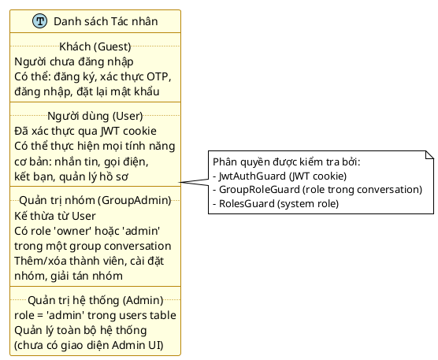
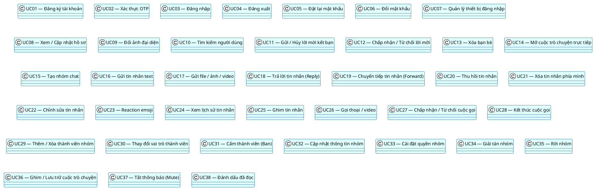
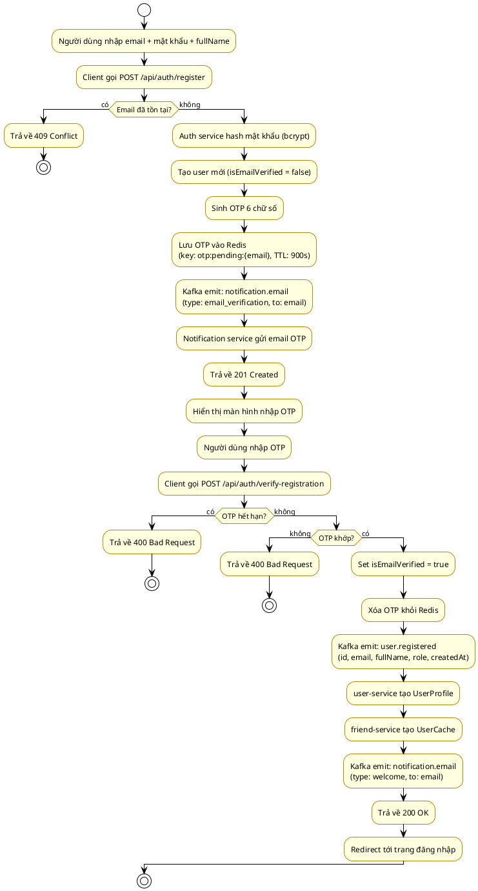
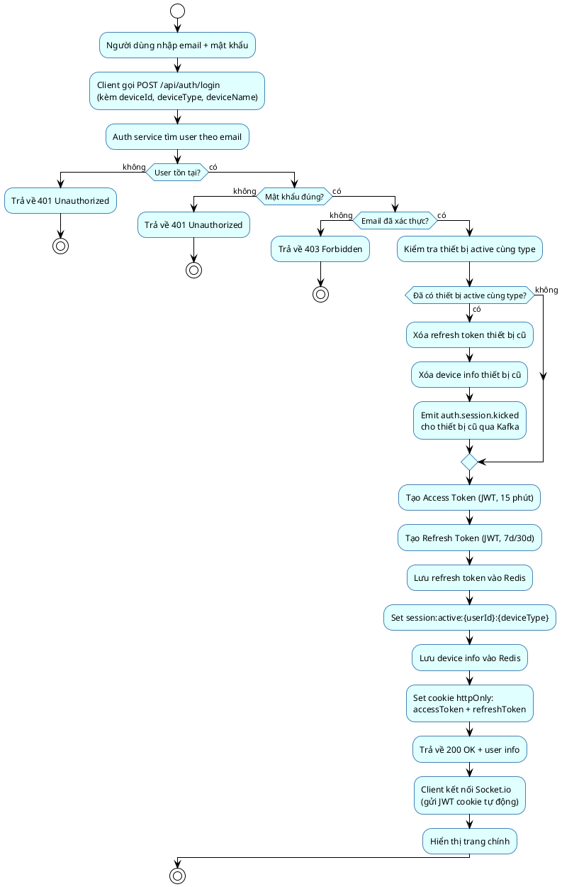
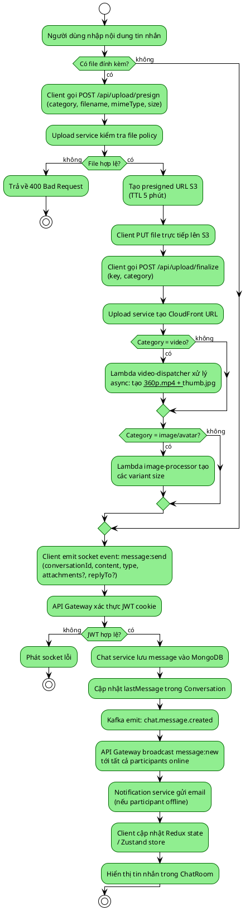
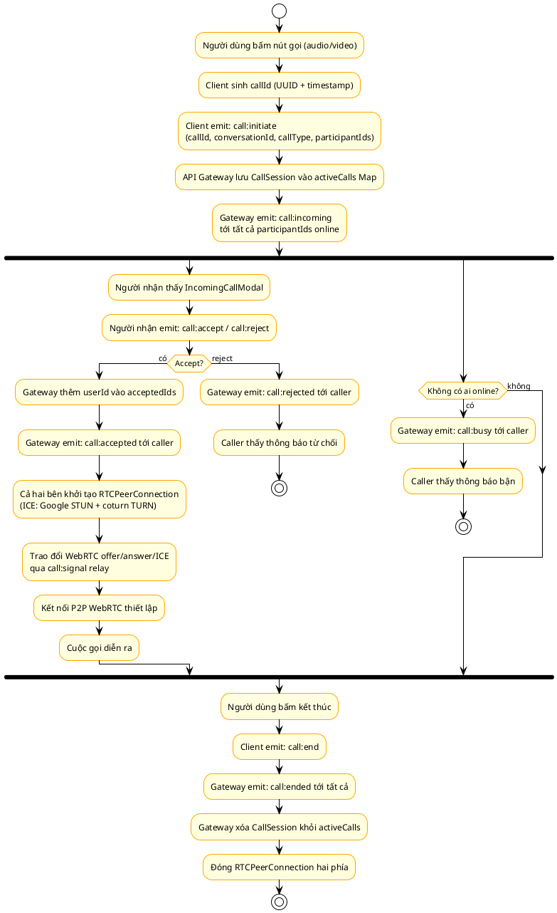
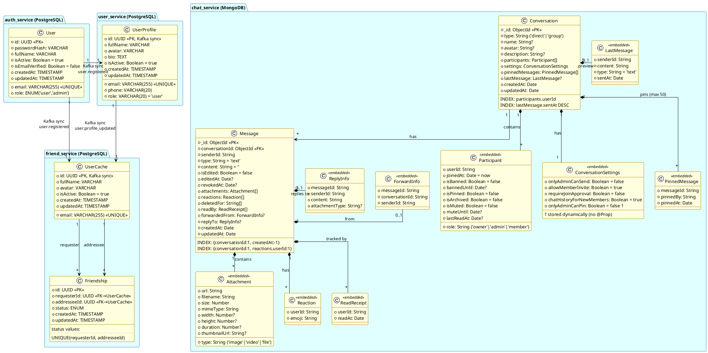
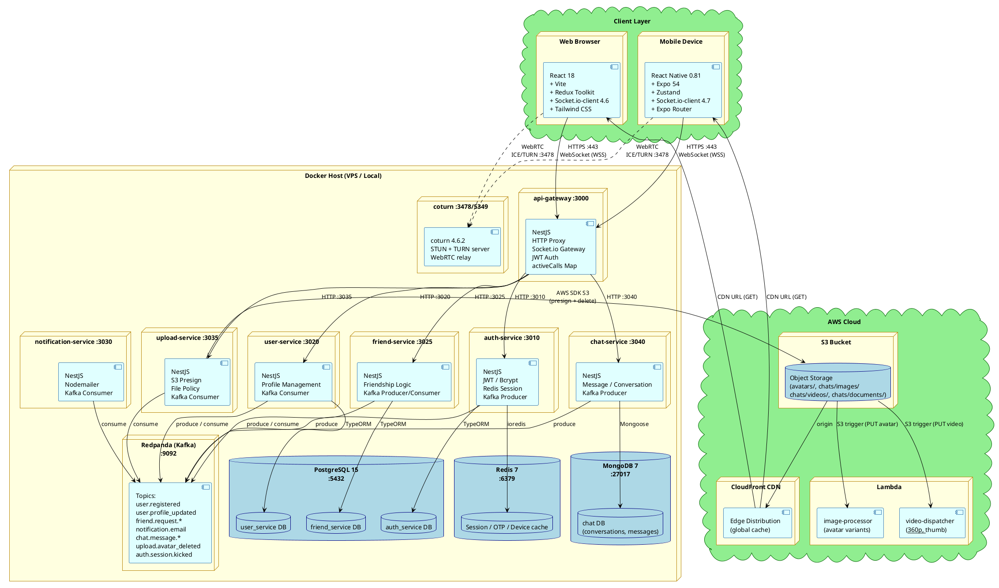

# UML Diagrams — BinChat

> PlantUML source code cho các sơ đồ UML trong báo cáo đồ án.

---

## 3.1.1 — Sơ đồ Use Case Tổng quát

```plantuml
@startuml UC_TONG_QUAT
!theme plain
skinparam actorStyle awesome
skinparam packageStyle rectangle
skinparam usecase {
  BackgroundColor LightYellow
  BorderColor DarkGoldenRod
  ArrowColor Gray
}
skinparam actor {
  BackgroundColor LightBlue
  BorderColor Navy
}

left to right direction

actor "Khách\n(Guest)" as Guest
actor "Người dùng\n(User)" as User
actor "Quản trị nhóm\n(GroupAdmin)" as GroupAdmin
actor "Quản trị hệ thống\n(Admin)" as Admin

User <|-- GroupAdmin : extends

rectangle "BinChat System" {

  package "Xác thực" {
    usecase "Đăng ký tài khoản" as UC_REGISTER
    usecase "Xác thực OTP" as UC_OTP
    usecase "Đăng nhập" as UC_LOGIN
    usecase "Đăng xuất" as UC_LOGOUT
    usecase "Đặt lại mật khẩu" as UC_RESET_PWD
    usecase "Đổi mật khẩu" as UC_CHANGE_PWD
    usecase "Quản lý thiết bị" as UC_DEVICES
  }

  package "Hồ sơ" {
    usecase "Xem hồ sơ cá nhân" as UC_VIEW_PROFILE
    usecase "Cập nhật hồ sơ" as UC_EDIT_PROFILE
    usecase "Đổi ảnh đại diện" as UC_AVATAR
  }

  package "Bạn bè" {
    usecase "Tìm kiếm người dùng" as UC_SEARCH_USER
    usecase "Gửi lời mời kết bạn" as UC_FRIEND_REQ
    usecase "Chấp nhận/Từ chối lời mời" as UC_FRIEND_ACCEPT
    usecase "Hủy lời mời kết bạn" as UC_FRIEND_CANCEL
    usecase "Xóa bạn bè" as UC_UNFRIEND
  }

  package "Nhắn tin" {
    usecase "Mở cuộc trò chuyện trực tiếp" as UC_OPEN_DIRECT
    usecase "Tạo nhóm chat" as UC_CREATE_GROUP
    usecase "Gửi tin nhắn text" as UC_SEND_TEXT
    usecase "Gửi file / ảnh / video" as UC_SEND_FILE
    usecase "Trả lời tin nhắn" as UC_REPLY
    usecase "Chuyển tiếp tin nhắn" as UC_FORWARD
    usecase "Thu hồi tin nhắn" as UC_REVOKE
    usecase "Xóa tin nhắn (phía mình)" as UC_DELETE
    usecase "Chỉnh sửa tin nhắn" as UC_EDIT_MSG
    usecase "Bày tỏ cảm xúc (Reaction)" as UC_REACT
    usecase "Xem lịch sử tin nhắn" as UC_HISTORY
    usecase "Ghim tin nhắn" as UC_PIN
  }

  package "Gọi điện" {
    usecase "Gọi thoại / video" as UC_CALL
    usecase "Chấp nhận cuộc gọi" as UC_ACCEPT_CALL
    usecase "Từ chối cuộc gọi" as UC_REJECT_CALL
    usecase "Kết thúc cuộc gọi" as UC_END_CALL
  }

  package "Quản lý nhóm" {
    usecase "Thêm thành viên" as UC_ADD_MEMBER
    usecase "Xóa thành viên" as UC_KICK_MEMBER
    usecase "Thay đổi vai trò" as UC_CHANGE_ROLE
    usecase "Cấm thành viên" as UC_BAN
    usecase "Cập nhật thông tin nhóm" as UC_UPDATE_GROUP
    usecase "Cài đặt nhóm" as UC_GROUP_SETTINGS
    usecase "Giải tán nhóm" as UC_DISSOLVE
    usecase "Rời nhóm" as UC_LEAVE
  }

  package "Cài đặt cá nhân" {
    usecase "Ghim / Lưu trữ cuộc trò chuyện" as UC_PIN_CONV
    usecase "Tắt thông báo" as UC_MUTE
    usecase "Đọc tin nhắn" as UC_READ
  }
}

' Guest
Guest --> UC_REGISTER
Guest --> UC_OTP
Guest --> UC_LOGIN
Guest --> UC_RESET_PWD

' User
User --> UC_LOGOUT
User --> UC_CHANGE_PWD
User --> UC_DEVICES
User --> UC_VIEW_PROFILE
User --> UC_EDIT_PROFILE
User --> UC_AVATAR
User --> UC_SEARCH_USER
User --> UC_FRIEND_REQ
User --> UC_FRIEND_ACCEPT
User --> UC_FRIEND_CANCEL
User --> UC_UNFRIEND
User --> UC_OPEN_DIRECT
User --> UC_CREATE_GROUP
User --> UC_SEND_TEXT
User --> UC_SEND_FILE
User --> UC_REPLY
User --> UC_FORWARD
User --> UC_REVOKE
User --> UC_DELETE
User --> UC_EDIT_MSG
User --> UC_REACT
User --> UC_HISTORY
User --> UC_CALL
User --> UC_ACCEPT_CALL
User --> UC_REJECT_CALL
User --> UC_END_CALL
User --> UC_PIN_CONV
User --> UC_MUTE
User --> UC_READ
User --> UC_LEAVE

' GroupAdmin
GroupAdmin --> UC_PIN
GroupAdmin --> UC_ADD_MEMBER
GroupAdmin --> UC_KICK_MEMBER
GroupAdmin --> UC_CHANGE_ROLE
GroupAdmin --> UC_BAN
GroupAdmin --> UC_UPDATE_GROUP
GroupAdmin --> UC_GROUP_SETTINGS
GroupAdmin --> UC_DISSOLVE

UC_REGISTER ..> UC_OTP : <<include>>
UC_RESET_PWD ..> UC_OTP : <<include>>
UC_SEND_FILE ..> UC_SEND_TEXT : <<extends>>
UC_REPLY ..> UC_SEND_TEXT : <<extends>>

@enduml
```

---

## 3.1.2 — Danh sách Tác nhân (Actors)

---

## 3.1.3 — Danh sách Use Cases

---

## 3.1.4 — Sơ đồ Hoạt động (Activity Diagrams)

### 3.1.4.1 — Đăng ký & Xác thực OTP

### 3.1.4.2 — Đăng nhập

### 3.1.4.3 — Gửi Tin nhắn

### 3.1.4.4 — Gọi Voice/Video

---

## 3.2 — Sơ đồ Lớp (Class Diagram)

---

## 3.3 — Sơ đồ Triển khai (Deployment Diagram)

---

> **Công cụ render:** Dán code vào [PlantUML Online Editor](https://www.plantuml.com/plantuml/uml/) hoặc dùng VS Code extension **PlantUML** (jebbs.plantuml).
>
> **Lưu ý:** Section 3.1.2 dùng class diagram style để trình bày bảng tác nhân do PlantUML không có table native.
