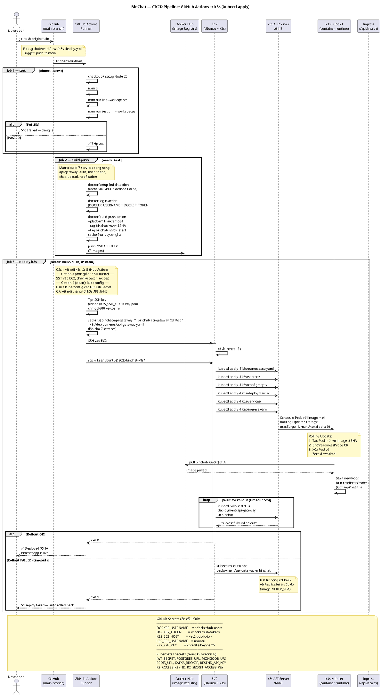
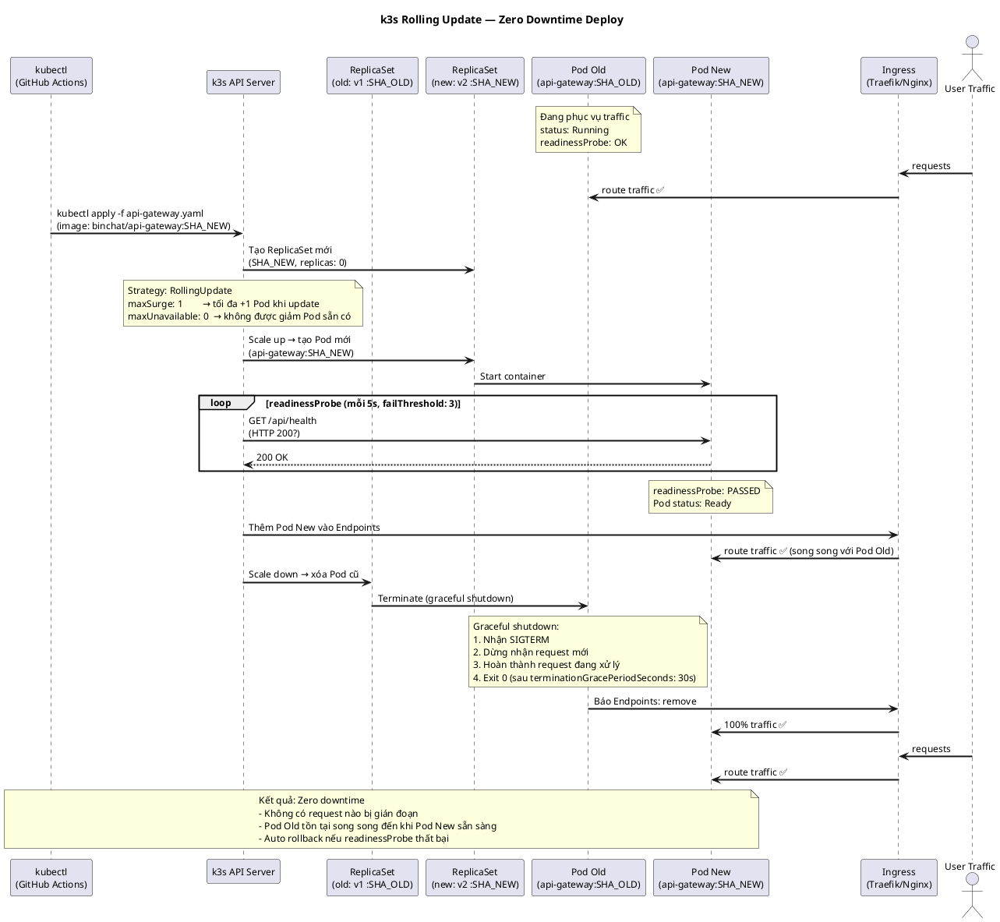
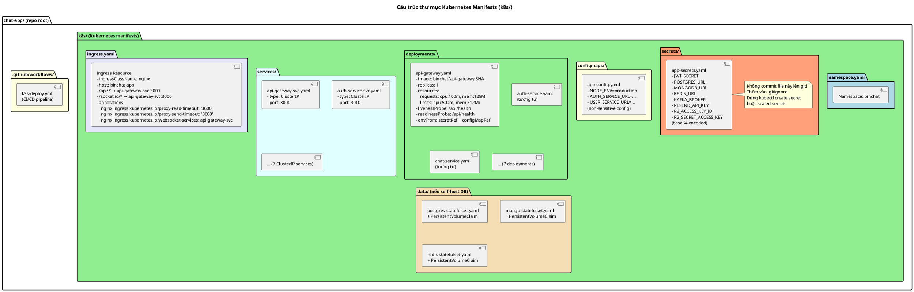
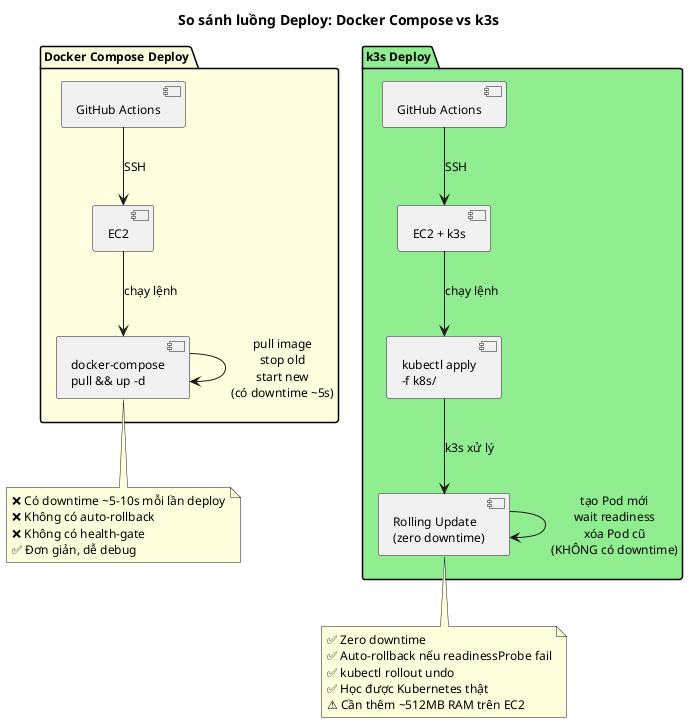

# UML — Triển khai với k3s (Kubernetes nhẹ trên EC2)

> **k3s** là bản Kubernetes nhẹ của Rancher Labs — chạy được trên EC2 t3.medium, tiêu tốn ~512MB RAM,  
> phù hợp để **học Kubernetes** mà không tốn tiền EKS ($72/tháng).  
> Tất cả sơ đồ dùng **PlantUML**.

---

## So sánh: Docker Compose vs k3s vs EKS

| Tiêu chí | Docker Compose | **k3s (đề xuất)** | EKS |
|---|---|---|---|
| Chi phí | $0 (overhead) | $0 (overhead) | ~$72/tháng control plane |
| Cài đặt | 1 lệnh | 1 lệnh | AWS Console + eksctl |
| Auto-restart | `restart: unless-stopped` | Pod restartPolicy | Managed |
| Health check | Docker healthcheck | Liveness/Readiness Probe | Managed |
| Rolling update | Không có | ✅ `kubectl rollout` | ✅ |
| Rollback | Thủ công | ✅ `kubectl rollout undo` | ✅ |
| Scale ngang | Không có | ✅ `kubectl scale` | ✅ Auto Scaling |
| ConfigMap/Secret | `.env` file | ✅ Kubernetes Secret | ✅ |
| Ingress / Routing | Nginx thủ công | ✅ Nginx Ingress Controller | ✅ ALB Ingress |
| Học Kubernetes | ❌ | ✅ Cú pháp y chang | ✅ |
| RAM overhead | ~50MB | ~512MB | N/A |

> **Kết luận**: k3s dùng cùng `kubectl`, cùng YAML manifest với Kubernetes thật → kiến thức chuyển sang EKS/GKE dễ dàng sau này.

---

## Sơ đồ 1 — Kiến trúc k3s trên EC2 (VPC Tier Architecture)

```plantuml
@startuml K3S_ARCHITECTURE

skinparam backgroundColor #FFFFFF
skinparam defaultFontSize 12
skinparam defaultFontName Arial
skinparam ArrowColor #555555
skinparam component {
  BackgroundColor #D6EAF8
  BorderColor #2980B9
}
skinparam database {
  BackgroundColor #FEF9E7
  BorderColor #F39C12
}
skinparam package {
  BorderColor #888888
  FontSize 12
}

title BinChat — k3s trên EC2 (Kubernetes nhẹ, $0 overhead)

'===========================================================
' LEFT: DevOps Workflow
'===========================================================
package "DevOps Workflow" #LightYellow {
  actor "Developer" as Dev
  component "GitHub\nRepository" as GH
  component "GitHub Actions\n(CI/CD Runner)" as GA
  component "Docker Hub\n(Image Registry)" as DHub

  Dev -down-> GH : git push main
  GH -down-> GA : trigger deploy.yml
  GA -down-> DHub : docker build\n& push :$SHA
}

'===========================================================
' AWS Cloud
'===========================================================
cloud "AWS Cloud" #AliceBlue {

  component "Cloudflare\n(DNS + CDN + DDoS)\nbinchat.app" as CF

  package "VPC — 10.0.0.0/16" {

    '--- Tier 1: Public ---
    package "Tier 1 — Public Subnet\n(Security Group: 80, 443, 6443*)" #LightBlue {
      component "Nginx Ingress Controller\n(k3s built-in Traefik hoặc Nginx)\n- SSL termination (Let's Encrypt)\n- Route /api/* → Gateway Service\n- Route /socket.io/* → Gateway Service\n- WebSocket upgrade\n- Rate limiting" as Ingress

      note right of Ingress
        *6443: kubectl API server port
        chỉ mở cho IP dev (SSH tunnel)
        Không mở public
      end note
    }

    '--- Tier 2: EC2 + k3s ---
    package "Tier 2 — EC2 t3.medium (2vCPU, 4GB RAM)\nPrivate App Subnet — k3s Single Node" #LightGreen {

      component "k3s Server\n(Control Plane + Worker\ntrên cùng 1 máy)" as K3S

      package "Kubernetes Namespace: binchat" {

        package "Deployments (Pods)" {
          component "api-gateway\nDeployment\nreplicas: 1\nPort: 3000" as GW
          component "auth-service\nDeployment\nreplicas: 1\nPort: 3010" as AUTH
          component "user-service\nDeployment\nreplicas: 1\nPort: 3020" as USER
          component "friend-service\nDeployment\nreplicas: 1\nPort: 3025" as FRIEND
          component "chat-service\nDeployment\nreplicas: 1\nPort: 3040" as CHAT
          component "upload-service\nDeployment\nreplicas: 1\nPort: 3035" as UPLOAD
          component "notification-service\nDeployment\nreplicas: 1\nPort: 3030" as NOTIF
        }

        package "Data StatefulSets (nếu self-host)" {
          database "PostgreSQL\nStatefulSet\n+ PersistentVolume" as PG
          database "MongoDB\nStatefulSet\n+ PersistentVolume" as Mongo
          database "Redis\nStatefulSet\n+ PersistentVolume" as Redis
          component "Redpanda\nStatefulSet\nKafka-compatible" as Kafka
        }

        package "Kubernetes Resources" {
          component "ConfigMap\n(non-secret config)" as CM
          component "Secret\n(JWT, DB passwords,\nAPI keys)" as SEC
          component "Services\n(ClusterIP cho internal\nNodePort cho Ingress)" as SVC
          component "Ingress Resource\n(routing rules)" as ING
        }
      }
    }

    '--- Tier 3: Managed Data (alternative) ---
    package "Tier 3 — Managed Data\n(Thay StatefulSets nếu tiết kiệm RAM)" #LightGoldenRodYellow {
      database "Neon.tech\n(Postgres Free)" as Neon
      database "MongoDB Atlas M0\n(Free 512MB)" as Atlas
      database "Upstash Redis\n(Free)" as UpRedis
      component "Upstash Kafka\n(Free)" as UpKafka
    }

    '--- Tier 4: Observability ---
    package "Tier 4 — Observability" #MistyRose {
      component "Prometheus\n(k3s built-in\nhoặc Grafana Cloud)" as Prom
      component "Grafana\n(hoặc Grafana Cloud Free)" as Grafana
    }
  }

  package "External Services" #Lavender {
    component "Cloudflare R2\n(Media storage)" as R2
    component "Resend.com\n(Email)" as Resend
    component "Metered.ca\n(TURN/WebRTC)" as Turn
    component "Expo Push\n(Mobile notify)" as ExpoPush
  }
}

package "Clients" #Honeydew {
  actor "Web Browser" as Web
  actor "Mobile (Expo)" as Mobile
}

'===========================================================
' Connections
'===========================================================

' DevOps → k3s
GA -right-> K3S : kubectl apply -f k8s/\n(via SSH tunnel / kubeconfig secret)
DHub -right-> K3S : pull image khi deploy

' DNS
CF -down-> Ingress : HTTPS binchat.app
Web -up-> CF : HTTPS
Mobile -up-> CF : HTTPS

' Ingress → Gateway
Ingress -down-> GW : /api/* + /socket.io/*

' Gateway → Services (ClusterIP)
GW -down-> AUTH : ClusterIP:3010
GW -down-> USER : ClusterIP:3020
GW -down-> FRIEND : ClusterIP:3025
GW -down-> CHAT : ClusterIP:3040
GW -down-> UPLOAD : ClusterIP:3035

' Services → Data
AUTH -down-> PG
USER -down-> PG
FRIEND -down-> PG
CHAT -down-> Mongo
AUTH -down-> Redis
GW -down-> Redis : socket presence

' Kafka
CHAT -right-> Kafka : produce
NOTIF -down-> Kafka : consume

' External services
UPLOAD -right-> R2
NOTIF -right-> Resend
NOTIF -right-> ExpoPush
GW -right-> Turn

' Config injection
SEC -up-> GW : envFrom secretRef
CM -up-> GW : envFrom configMapRef

' Observability
GW -right-> Prom : /metrics
Prom -right-> Grafana

@enduml
```



---

## Sơ đồ 2 — CI/CD Pipeline với k3s (GitHub Actions → kubectl apply)



---

## Sơ đồ 3 — Luồng Rolling Update (Zero Downtime)



---

## Sơ đồ 4 — Cấu trúc thư mục k8s manifests



---

## Sơ đồ 5 — So sánh CI/CD: Docker Compose vs k3s



---

## Hướng dẫn cài k3s trên EC2

### 1. Cài k3s (1 lệnh)

```bash
# Trên EC2 Ubuntu 22.04
curl -sfL https://get.k3s.io | sh -

# Kiểm tra
kubectl get nodes
# NAME        STATUS   ROLES                  AGE   VERSION
# ip-10-0-x  Ready    control-plane,master   30s   v1.29.x+k3s1
```

### 2. Cài Nginx Ingress Controller

```bash
# k3s mặc định dùng Traefik, nếu muốn Nginx:
kubectl apply -f https://raw.githubusercontent.com/kubernetes/ingress-nginx/main/deploy/static/provider/cloud/deploy.yaml
```

### 3. Tạo namespace và secrets

```bash
kubectl create namespace binchat

kubectl create secret generic app-secrets \
  --from-literal=JWT_SECRET=<your-secret> \
  --from-literal=POSTGRES_URL=postgresql://... \
  --from-literal=MONGODB_URI=mongodb+srv://... \
  --from-literal=REDIS_URL=rediss://... \
  -n binchat
```

### 4. Deploy

```bash
kubectl apply -f k8s/ -n binchat

# Theo dõi rolling update
kubectl rollout status deployment/api-gateway -n binchat

# Rollback nếu cần
kubectl rollout undo deployment/api-gateway -n binchat
```

### 5. Lấy kubeconfig để dùng từ local

```bash
# Trên EC2
sudo cat /etc/rancher/k3s/k3s.yaml

# Copy về máy local, thay server IP
# server: https://127.0.0.1:6443
# → server: https://<ec2-public-ip>:6443
```

---

## GitHub Secrets cần cấu hình

```
DOCKER_USERNAME     = <dockerhub-username>
DOCKER_TOKEN        = <dockerhub-access-token>
K3S_EC2_HOST        = <ec2-public-ip>
K3S_EC2_USERNAME    = ubuntu
K3S_SSH_KEY         = <private-key-pem-content>
```
