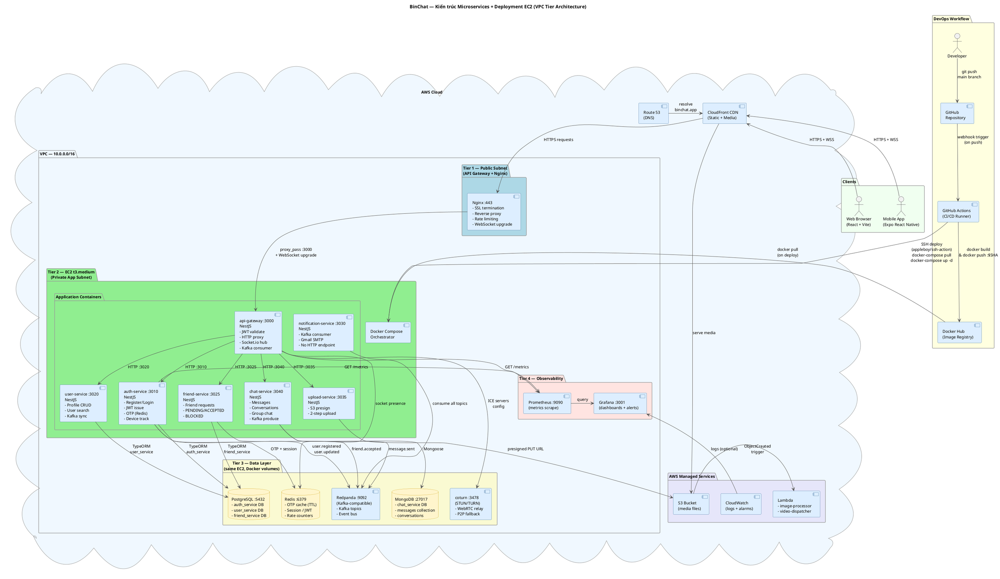
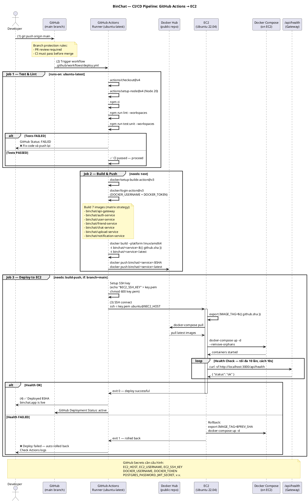
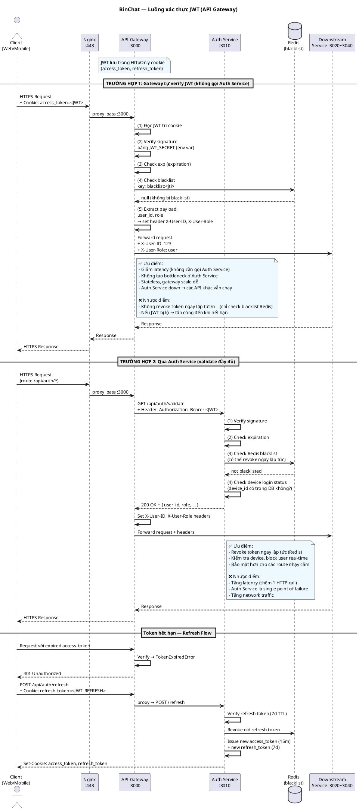
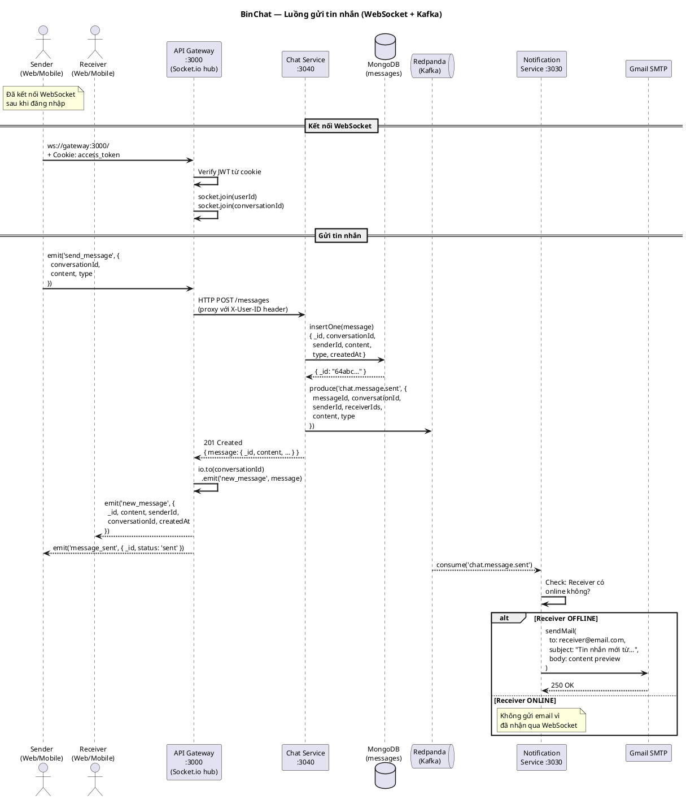

# UML — Kiến trúc hiện tại + Deployment EC2 + CI/CD

> **BinChat** — Microservices Chat App  
> Tất cả sơ đồ dùng **PlantUML** — render bằng VS Code extension `PlantUML` hoặc [plantuml.com](https://www.plantuml.com/plantuml/uml)

---

## Sơ đồ 1 — Kiến trúc tổng thể + VPC Deployment trên EC2

> Sơ đồ này kết hợp **kiến trúc microservices**, **deployment trên EC2**, và **DevOps workflow** trong một view.  
> Tham khảo từ Fig 4. System Design (VPC Tier Architecture).

---

## Sơ đồ 2 — CI/CD Pipeline (GitHub Actions → EC2)

> Luồng đầy đủ từ khi developer push code đến khi hệ thống chạy trên EC2.

---

## Sơ đồ 3 — Luồng xác thực JWT (2 trường hợp)

> Tham khảo Fig 4: **Quy trình check auth qua Auth Service** và **không qua Auth Service**.

---

## Sơ đồ 4 — Luồng gửi tin nhắn real-time

---

## Ghi chú kiến trúc hiện tại

| Thành phần | Công nghệ | Ghi chú |
|---|---|---|
| API Gateway | NestJS :3000 | JWT verify, HTTP proxy, Socket.io |
| Auth Service | NestJS + PostgreSQL :3010 | JWT 15m/7d, bcrypt, OTP Redis |
| User Service | NestJS + PostgreSQL :3020 | Profile, search, Kafka sync |
| Friend Service | NestJS + PostgreSQL :3025 | PENDING/ACCEPTED/DECLINED/BLOCKED |
| Chat Service | NestJS + MongoDB :3040 | Messages, conversations, groups |
| Upload Service | NestJS + S3 :3035 | Presign 2-step, CloudFront CDN |
| Notification Service | NestJS :3030 | Kafka consumer only, Gmail SMTP |
| Event Bus | Redpanda (Kafka API) :9092 | Single node, Kafka-compatible |
| Cache | Redis :6379 | OTP TTL, session, rate limiter |
| TURN Server | coturn :3478 | WebRTC P2P fallback |
| CI/CD | GitHub Actions | SSH → EC2, docker-compose pull & up |
| Registry | Docker Hub | Free public repo |
| Compute | EC2 t3.medium | 2vCPU, 4GB RAM, Ubuntu 22.04 |

### Điểm yếu cần cải thiện

| Vấn đề | Nguyên nhân | Giải pháp |
|---|---|---|
| Socket.io state in-memory | Không dùng Redis adapter | Thêm Upstash Redis adapter |
| Không có rate limiting | Gateway chưa cấu hình | Redis-based rate limit |
| MongoDB không có index | Schema không khai báo index | Thêm compound index |
| Không có monitoring | Chưa cài Prometheus/Grafana | Grafana Cloud free |
| coturn không TLS | Config đơn giản | TLS + credentials |
| Single-node Redpanda | Không có HA | Upstash Kafka managed |
| Lambda/S3 egress tốn tiền | AWS pricing | Cloudflare R2 + Workers |
